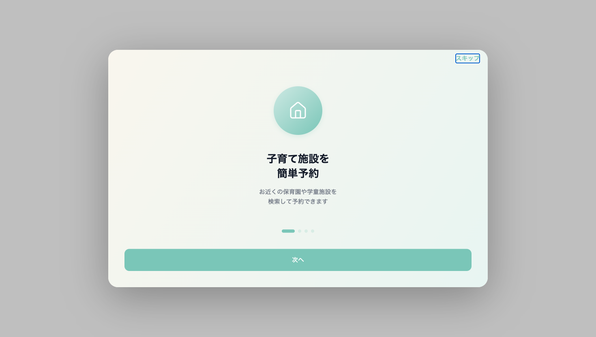
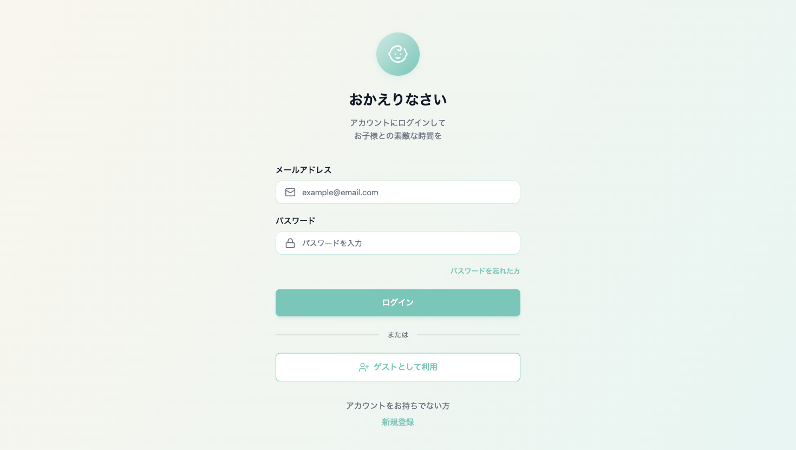
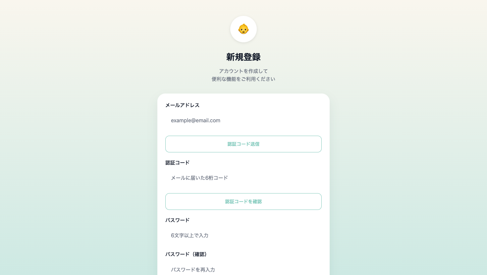
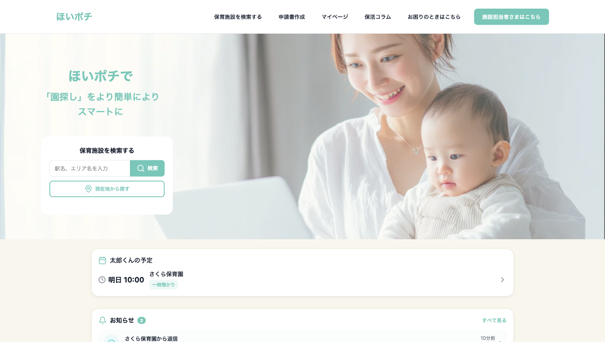
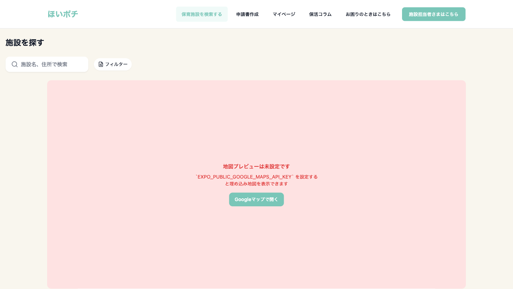
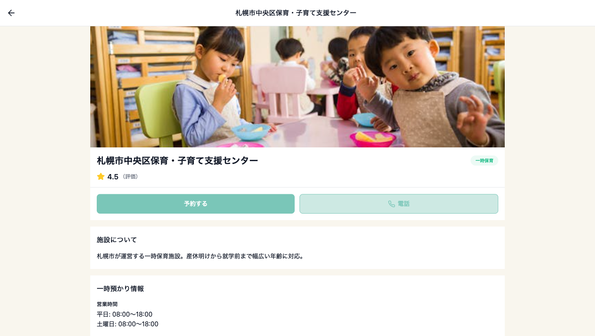
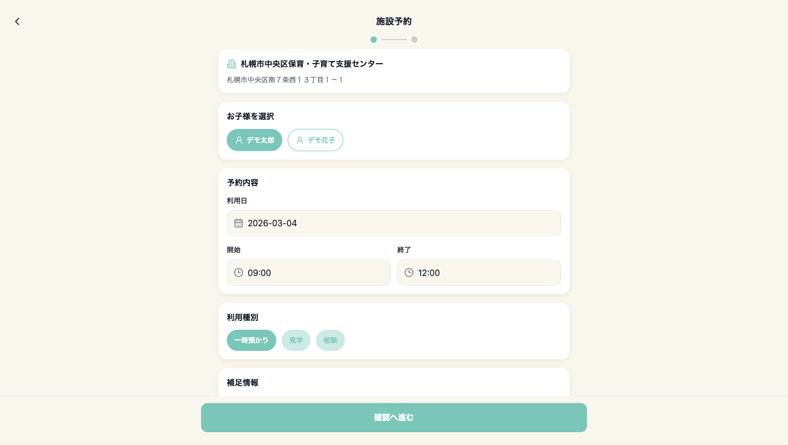
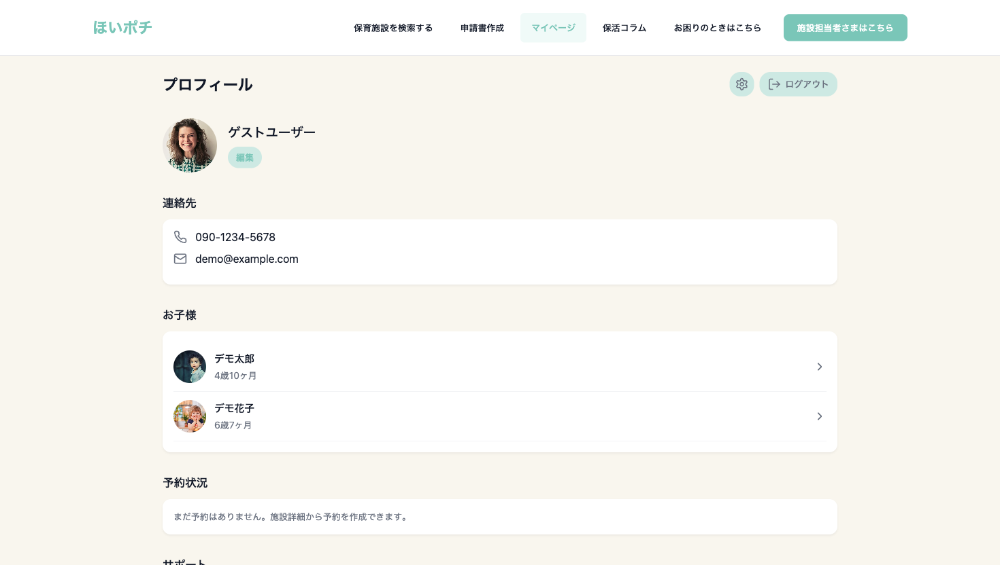

# Child Care App Start Guide

このガイドは、ローカル起動した Web 版アプリを最短で確認するためのスタートガイドです。
2026-03-03 の確認時点で取得した実画面スクリーンショットを使って、起動から主要画面までの流れをまとめています。

## 1. 起動

リポジトリルートで以下を実行します。

```bash
npm install
npm run web
```

起動後、ブラウザで `http://localhost:8081` を開きます。

補足:
- `.env.local` に `EXPO_PUBLIC_SUPABASE_URL` と `EXPO_PUBLIC_SUPABASE_ANON_KEY` が入っていれば、クライアントは Supabase 実接続モードで起動します
- Google Maps を正常表示したい場合は `EXPO_PUBLIC_GOOGLE_MAPS_API_KEY` が必要です

## 2. オンボーディング

最初にオンボーディング画面が表示されます。内容確認後、`スキップ` または `次へ` で進みます。



## 3. ログイン

ログイン画面では、通常ログインとゲスト利用の両方が使えます。
画面確認だけなら `ゲストとして利用` が最短です。



## 4. 新規登録

新規登録画面では、メールアドレス、認証コード、パスワードの入力フローが用意されています。
実運用ではメール認証用の Edge Function と Resend 設定が必要です。



## 5. ホーム

ゲストログイン後はホーム画面に入ります。
ここから施設検索、申請書作成、マイページ、コラム、サポート導線へ移動できます。



主な確認ポイント:
- 上部ナビゲーション
- 施設検索フォーム
- お知らせカード
- コラム一覧
- 人気施設一覧

## 6. 施設検索

`保育施設を検索する` から施設検索画面へ進みます。
施設一覧と地図の両方が表示されます。



確認ポイント:
- 検索ボックス
- フィルター
- 地図
- 施設カード一覧

現状の注意:
- Google Maps API キー未設定時は、埋め込み地図の代わりにフォールバック案内と `Googleマップで開く` ボタンが表示されます

## 7. 施設詳細

施設カードを開くと、施設詳細画面に遷移します。
施設概要、営業時間、定員、対象年齢、電話番号、地図を確認できます。



確認ポイント:
- `予約する` ボタン
- 一時預かり情報
- 電話導線
- 施設住所とアクセス

## 8. 予約作成

施設詳細の `予約する` から予約作成画面に進みます。
お子様選択、利用日、時間、利用種別、補足情報の入力が可能です。



確認ポイント:
- お子様切り替え
- 日付と時間
- 利用種別
- 確認画面への遷移

補足:
- ゲストユーザーでは最終送信成功までは確認していません
- 現コードでは、ゲスト ID が UUID ではないため予約送信は失敗する想定です

## 9. マイページ

`マイページ` では、プロフィール、連絡先、お子様一覧、予約状況、サポート導線を確認できます。



確認ポイント:
- 保護者プロフィール
- お子様カード
- 予約状況セクション
- ログアウト

現状の注意:
- ゲストユーザーでは予約欄は空表示になります
- ゲスト時は予約取得を呼ばないため、以前の Supabase コンソールエラーは出ません

## 10. 現時点での見どころ

このアプリは、画面導線と主要 UI はかなり揃っています。
特に以下は確認しやすい状態です。

- オンボーディング
- ログイン / 登録導線
- ホーム画面
- 施設検索
- 施設詳細
- 予約作成 UI
- マイページ

一方で、ローカル確認時の課題はまだあります。

- Google Maps API キー未設定
- ゲストユーザー時の予約取得エラー
- 実アカウントでの予約送信完了は未検証

## 11. 関連ドキュメント

- Web 確認結果の詳細: [WEB_TEST_REPORT_20260303.md](./WEB_TEST_REPORT_20260303.md)
- Google Maps 設定: [GOOGLE_MAPS_SETUP.md](./GOOGLE_MAPS_SETUP.md)
- 実装状況: [IMPLEMENTATION_STATUS_20260303.md](./IMPLEMENTATION_STATUS_20260303.md)
